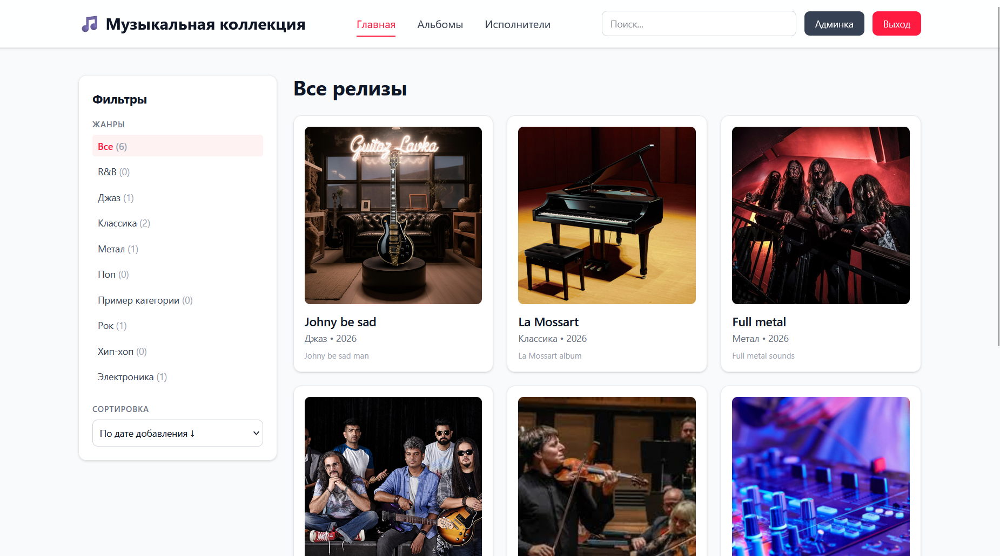
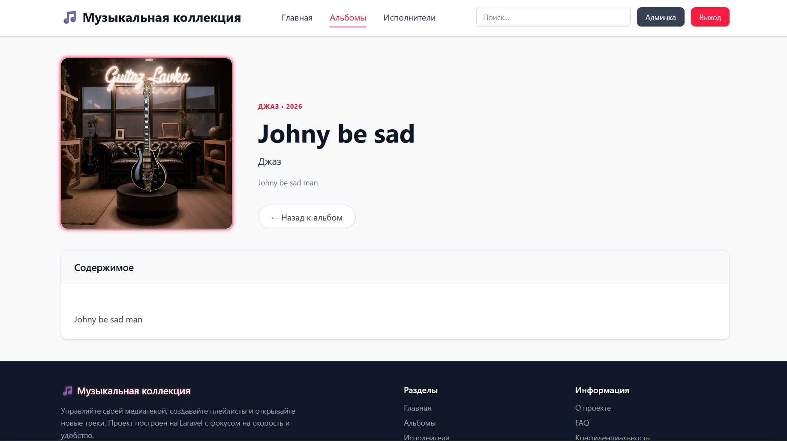
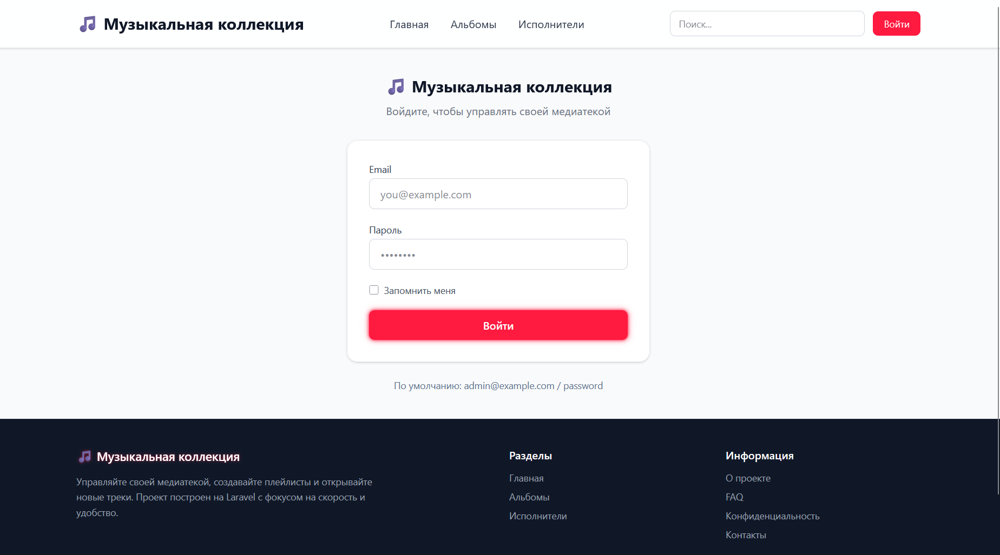
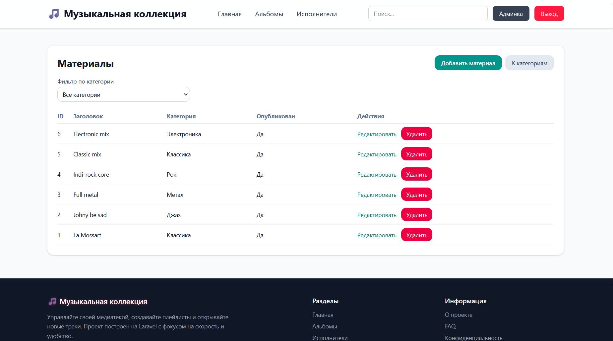
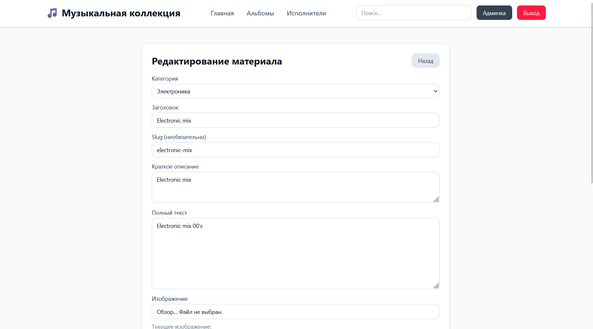

# 🎵 Музыкальная коллекция

Веб-приложение для управления коллекцией музыки — альбомов, исполнителей и жанров. Публичная часть позволяет просматривать каталог, фильтровать по жанрам, искать материалы и читать детальные страницы. Админ-панель обеспечивает полный CRUD для управления контентом.

## Скриншоты

### Главная страница


### Страница альбома


### Страница входа


### Админ-панель


### Редактирование в админ-панели


## Стек технологий

| Категория | Технологии |
|-----------|------------|
| **Backend** | PHP 8.3+, Laravel 13 |
| **Frontend** | Blade Templates, Tailwind CSS v4, Vite 8 |
| **База данных** | SQLite (по умолчанию), поддержка MySQL/PostgreSQL |
| **Сборка** | Vite, laravel-vite-plugin |
| **Тестирование** | PHPUnit 12 |
| **Форматирование** | Laravel Pint |
| **Дев-утилиты** | Faker, Pail, Concurrently |

## Возможности

### Публичная часть
- **Главная страница** — последние релизы с фильтрацией по жанрам и сортировкой
- **Каталог альбомов** — список всех материалов с пагинацией и поиском
- **Страница альбома** — детальная информация с обложкой и описанием
- **Страница жанра** — материалы конкретной категории
- **Поиск** — по названию, описанию и содержимому
- **Адаптивный дизайн** — мобильное меню, адаптивные сетки

### Админ-панель
- **CRUD жанров** — создание, редактирование, удаление категорий
- **CRUD материалов** — полный цикл управления альбомами
- **Загрузка изображений** — обложки для альбомов с автоматическим сохранением
- **Управление публикацией** — флаг `is_published` и дата публикации
- **Авторизация** — вход/выход с защитой от session fixation

### Технические особенности
- Route model binding по `slug`
- Автоматическая генерация `excerpt` из содержимого
- Удаление файлов при удалении записей
- Каскадное удаление материалов при удалении категории
- Neon-glow стилизация с акцентным цветом `#ff1a40`

## Структура БД

```
users
  - id, name, email, password, timestamps

categories
  - id, name, slug (unique), description (nullable), timestamps

posts
  - id, category_id (FK → categories, cascade), title, slug (unique),
    excerpt, content, image (nullable), published_at (nullable),
    is_published, timestamps
```

## Быстрый запуск

```bash
# Установка зависимостей
composer install
npm install

# Настройка окружения
cp .env.example .env
php artisan key:generate

# Миграции и сиды
php artisan migrate:fresh --seed
php artisan storage:link

# Сборка ассетов
npm run build

# Запуск
composer run dev
```

## Данные для входа в админку

| Поле | Значение |
|------|----------|
| URL | `/login` |
| Email | `admin@example.com` |
| Пароль | `password` |

## Основные маршруты

| Метод | URL | Описание |
|-------|-----|----------|
| GET | `/` | Главная страница |
| GET | `/posts` | Каталог альбомов |
| GET | `/posts/{slug}` | Страница альбома |
| GET | `/categories` | Список жанров |
| GET | `/categories/{slug}` | Жанр и его материалы |
| GET | `/login` | Форма входа |
| POST | `/login` | Авторизация |
| POST | `/logout` | Выход |
| GET/POST/PUT/DELETE | `/admin/posts` | CRUD материалов |
| GET/POST/PUT/DELETE | `/admin/categories` | CRUD жанров |

## Структура проекта

```
app/
├── Http/Controllers/
│   ├── Admin/
│   │   ├── CategoryController.php   # CRUD жанров
│   │   └── PostController.php        # CRUD материалов
│   ├── AuthController.php            # Авторизация
│   ├── CategoryController.php        # Публичные жанры
│   ├── HomeController.php            # Главная
│   └── PostController.php            # Публичные материалы
├── Models/
│   ├── Category.php                  # Модель жанра
│   ├── Post.php                      # Модель альбома
│   └── User.php                      # Модель пользователя
resources/views/
├── layouts/app.blade.php             # Основной layout
├── home.blade.php                    # Главная
├── posts/                            # Публичные материалы
├── categories/                       # Публичные жанры
├── admin/                            # Админ-панель
└── auth/                             # Авторизация
```

## Лицензия

MIT
